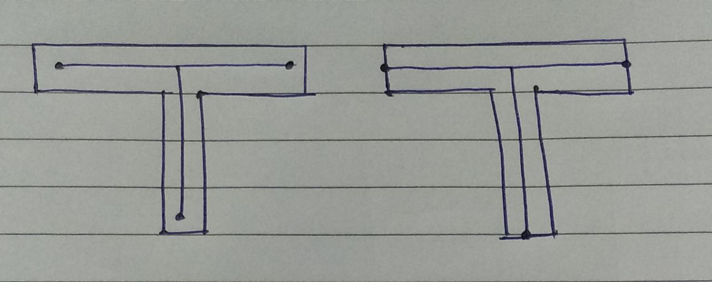

# Notes on Midcurve NN
	
## A wider research domain: CAD with Deep Learning

Vectorization is a must for preparing input for Machine/Deep Learning

Comparison of NLP and CAD wrt vectorization:

|    NLP                                 |    CAD                              | 
|----------------------------------------|-------------------------------------|
|    Words                               |    Entities                         | 
|    Sentences composed of words         |    Features composed of entities    | 
|    Paragraphs composed of sentences    |    Bodies composed of features      | 
|    Document composed of sentences      |    Assemblies composed of bodies    | 

## FAQs
- Which of the following is the correct result?
  
  - Right one
- When do you get better results?
  - First, clean the pkl files from model directory. changed the optimizer to Adam just now and in 10 epochs, it's giving good results. So I think after training for 200 epochs as originally, it should do the trick
  - Normalization had to be added because of the binary crossentropy loss. I saw that the loss was falling below 0.
  - As our predicted y was between 0 and 1 because of sigmoid and actual y was 0 and 255
- These are some results from the Simple Encoder Decoder approach, trained with Adam on 100 epochs. 
  Are these results ok, with newer dataset? I think that this model is actually overfitting, and won't be able to generalize well.Using the weighted binary crossentropy for UNets improved the results significantly, so we can try weighted BCE or balanced BCE for other approaches as well, and get the results.
   
    
  For improving the unet results I have some things to try
	1. Change the loss function from weighted BCE to a distance based loss as used in the unet paper
	2. Add activations from the auxiliary decoder to the main decoder branch
  - Yes they are..little less noise  though.
- Are different thicknesses ok?  Should these widths be same? I remember you once telling me something about the polygon should have same thickness or something?
  - Yes, my standard set followed that. Most of these shapes are from other researchers papers..although they relax it a bit.but still keep THINNESS ..although of different widths...wineglass shape is another such example

- I modified the current approach such that the input to the model is the middle image, instead of the first one. This solved the issue that the model was drawing lines where it wasn't supposed to. The right most one is the result of current model which wasn't trained on this shape.
  . I was thinking for inference, we could use opencv's floodfill or some algorithm to fill the closed polygon given as input image. That's what I have done here. The only issue is that we have to find the gray level for image thresholding. That would be constant if we have images coming from the same source
  - Good point. Even filled polygons are theoretically correct inputs. Filled region represents material side. 
    The input shapes are simple enough to be drawn in Paint with filled in. Then transformations can be applied to generate variations. 
    If all approaches work well on this...We can have another directory for them and point to it from all approaches.
  
- I don't think the dense/simple encoder decoder would work well on the new data.. that's because it's difficult to do image to image translation as is, on top of that fully connected networks lack the structure to encode useful image properties
  Which is why I had earlier suggested that the simple encoder decoder has overfit the data which is why it was giving good results and would not be able to generalize
  CNN encoder decoder might give better/comparable results with the UNet approach using the filled image as input.
  pix2pix as you said is theoretically incorrect to model this problem
  Which is also the reason why we don't really use dense networks even for image classification
  So I think we should focus on just the UNet approach, and maybe the CNN encoder decoder
  The only issue with current unet is with the joints, which I think would be solved with the weight maps trick weighing the region near the joints more than the other parts.. I'm trying to figure out the implementation details for the same
  I also wanted to ask one more thing - is there any python script or something that could be used to get the midcurves for the approaches currently being used? So that we could show the comparison of the current approaches vs our approach
  - No, unfortunately not. As there is no standard/one algorithm for it.
    Even things that are not working is important information and should be kept as demonstration. So all approaches can be tried on both hollow profiles and filled ones. Results can be gathered and even mentioned in papers to come. Looks ok?
	This also should be tried and documented, along with note that for such and such reasons the approach is not appropriate...imho..let others agree/counter...

## References
*	Geometric Deep Learning http://geometricdeeplearning.com/ 
*	3D Machine Learning https://github.com/timzhang642/3D-Machine-Learning/blob/master/README.md
*	Pointer Networks https://pdfs.semanticscholar.org/eb5c/1ce6818333560d0d3247c0c74985ef295d9d.pdf
*	Feature Recognition
		* 	https://ai.stackexchange.com/questions/5011/using-machine-learning-to-identify-cad-model-features
		* 	https://orca.cf.ac.uk/86873/1/2016niuzphd.pdf
*	Shape2vec:
		* 	A neural network is trained to generate shape descriptors that lie close to a vector representation of the shape class, given a vector space of words. This method is easily extendable to range scans, hand-drawn sketches and images. This makes cross-modal retrieval possible, without a need to design different methods depending on the query type. We show that sketch-based shape retrieval using semantic-based descriptors outperforms the state-of-the-art by large margins, and mesh-based retrieval generates results of higher relevance to the query, than current deep shape descriptors.  https://github.com/ftasse/Shape2Vec https://www.cl.cam.ac.uk/research/rainbow/projects/shape2vec/ 
		*	Shape2vec: Understanding 3D Shapes With AI | Two Minute Papers #138 https://www.youtube.com/watch?v=bB54Wz4kq0E
*	Courses
		*	https://www.cse.iitb.ac.in/~cs749/spr2017/
		*	Machine Learning on Geometrical Data https://cse291-i.github.io/index.html
		*	Machine Learning for 3D Data http://graphics.stanford.edu/courses/cs468-17-spring/ 
		*	Geometric Modeling and Analysis CS597D https://www.cs.princeton.edu/courses/archive/fall03/cs597D/ 
*	People
		*	https://www.cse.iitb.ac.in/~sidch/ 
		*	Hao Li http://www.hao-li.com/Hao_Li/Hao_Li_-_about_me.html Human Digitization
		*	Hao Su Stanford http://3ddl.cs.princeton.edu/2016/slides/su.pdf haosu@ucsd.edu
		
* Applications of Machine Learning in CAD/PLM
http://ndesign.co/2017/03/09/applications-of-machine-learning-in-cadplm/
Common applications
	*	Categorize parts across libraries by their shapes and parameters.
	*	Parametrize STL and IGES, using geometry parsers and library of standard parameters for the parts and assemblies.
	*	Interaction with CAD systems using text or voice conversation in natural language: review the model (pan, rotate, zoom, comments, etc.), call common commands and perform input.
	*	Improving the behavior of wizards and generators according to standards and technical specification of overall project.
	*	Fasteners generator
	*	Frame generator
	*	Mold-base generator for casting and molding
	*	Hole generator
	*	Thread generator
	*	Design check of performed design operations according to standards and technical specifications.

* DGLMA Workshop IEEE BigData https://www.cse.msu.edu/~derrtyle/dglma/
* GRAPH2SEQ https://arxiv.org/pdf/1804.00823.pdf
* Graph2Seq: A Generalized Seq2Seq Model for Graph Inputs | IBM Research Blog https://www.ibm.com/blogs/research/2018/11/graph2seq/
* Learning Compact Graph Representations via an Encoder-Decoder Network https://appliednetsci.springeropen.com/track/pdf/10.1007/s41109-019-0157-9
* What is Geometric Deep Learning? - Flawnson Tong - Medium https://medium.com/@flawnsontong1/what-is-geometric-deep-learning-b2adb662d91d
* A Gentle Introduction to Graph Neural Networks (Basics, DeepWalk, and GraphSage) https://towardsdatascience.com/a-gentle-introduction-to-graph-neural-network-basics-deepwalk-and-graphsage-db5d540d50b3
* cvpr17_oral_pointnet https://web.stanford.edu/~rqi/pointnet/docs/cvpr17_pointnet_slides.pdf
* Understanding Machine Learning on Point Clouds through PointNet++ https://towardsdatascience.com/understanding-machine-learning-on-point-clouds-through-pointnet-f8f3f2d53cc3
* Iterative Deep Graph Learning for Graph Neural Networks https://openreview.net/pdf?id=Bkl2UlrFwr
* Deep Graph Library https://arxiv.org/pdf/1909.01315.pdf
* IEEEtv | Conference Highlights | Deep Graph Learning: Techniques and Applications - Haifeng Chen - IEEE Sarnoff Symposium, 2019 http://ieeetv.ieee.org/mobile/video/deep-graph-learning-techniques-and-applications-haifeng-chen-ieee-sarnoff-symposium-2019
* Welcome to Keras Deep Learning on Graphs (Keras-DGL) http://vermaMachineLearning.github.io/keras-deep-graph-learning 
* Deep Feature Learning for Graphs 	http://ryanrossi.com/pubs/rossi-et-al-2017-arxiv-deepGL-deep-graph-learning.pdf
* Master Seminar "Deep Learning for Graphs" / "Recent Developments in Data Science" (WS 2019/20) - Lehr- und Forschungseinheit für Datenbanksysteme - LMU Munich https://www.dbs.ifi.lmu.de/cms/studium_lehre/lehre_master/semrecent1920/index.html
* IEEEtv | Conference Highlights | Combinatorial Sleeping Bandits with Fairness Constraints - Bo Ji - IEEE Sarnoff Symposium, 2019 https://ieeetv.ieee.org/conference-highlights/combinatorial-sleeping-bandits-with-fairness-constraints-bo-ji-ieee-sarnoff-symposium-2019?
* A Comprehensive Survey on Graph Neural https://arxiv.org/pdf/1901.00596.pdf
* Tutorial on Variational Graph Auto-Encoders - Towards Data Science https://towardsdatascience.com/tutorial-on-variational-graph-auto-encoders-da9333281129
* Semi-automated Annotation model , Polygon RNN, Polygon RNN++ https://medium.com/@akichan_f/semi-automated-annotation-model-polygon-rnn-polygon-rnn-fa3801019a29
* graph-based-deep-learning-literature/README.md at master · naganandy/graph-based-deep-learning-literature https://github.com/naganandy/graph-based-deep-learning-literature/blob/master/conference-publications/README.md
* https://www.cse.msu.edu/~derrtyle/dglma/papers/ChoongJ.pdf
* https://www.cse.msu.edu/~derrtyle/dglma/papers/KikuchiS.pdf
* SkeletonNet: Shape Pixel to Skeleton Pixel, https://arxiv.org/abs/1907.01683v1