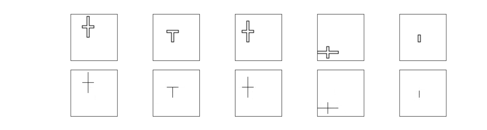

# Dataset for Midcurve Computation

## Description
Dataset: set of images, can be considered as pairs, profiles and their corresponding midcurves, with naming convention as
	- Profile: "I_Profile_mirrored_0.png" has corresponding
	- Midcurve: "I_Midcurve_mirrored_0.png"
	- Format is: <shape name>_<Profile/Midcurve>_<transformation>_<parameter>.png

Usage: Encoder Decoder like Semantic Segmentation or Pix2Pix on images to learn dimension reduction

## More explanation:
- Vixra paper MidcurveNN: Encoder-Decoder Neural Network for Computing Midcurve of a Thin Polygon, viXra.org e-Print archive, viXra:1904.0429 http://vixra.org/abs/1904.0429 
- ODSC proposal https://confengine.com/odsc-india-2019/proposal/10090/midcurvenn-encoder-decoder-neural-network-for-computing-midcurve-of-a-thin-polygon
- CAD Conference 2021, Barcelona, pages 223-225 http://www.cad-conference.net/files/CAD21/CAD21_223-225.pdf
